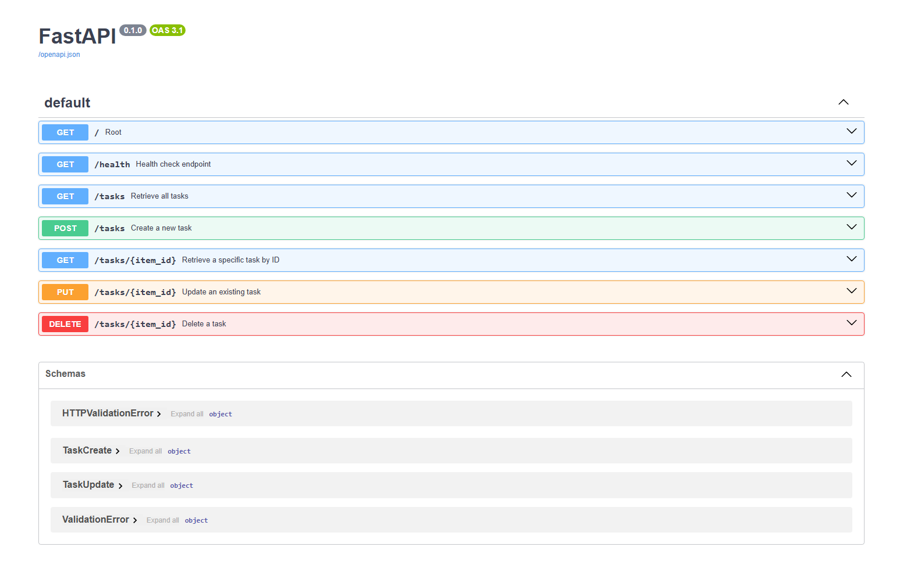
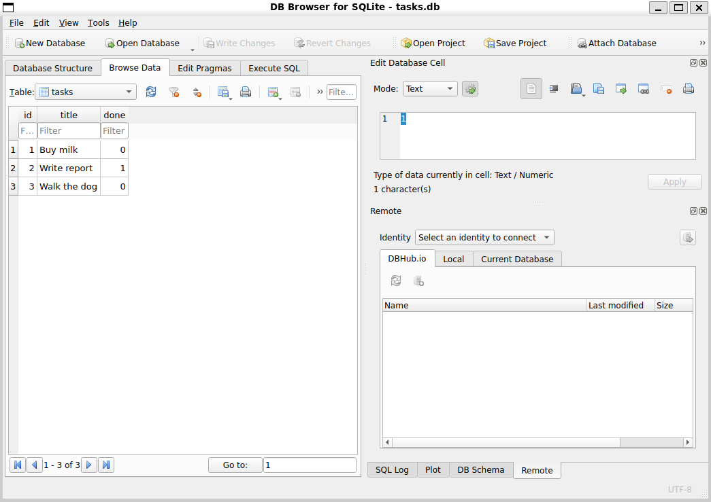
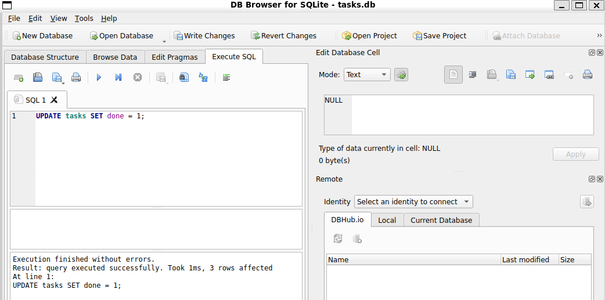
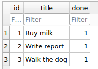

# CRUD API _w2a1
Fly rankAI Internship Assignment, backend engineering ex1

# Task Management API

A simple CRUD API for managing tasks, built with Python and FastAPI. This project demonstrates basic API routing, data validation with Pydantic, HTTP status code handling, and auto-generated Swagger UI documentation.

## How to Install & Run

This project uses `uv` for dependency management. Requirements are listed in `pyproject.toml`.

1. Clone the repo.
2. Run:

```bash
uv sync
uv run fastapi dev main.py
```

The API will be available at `http://localhost:8000`. On first run, `tasks.db` is created automatically with the `tasks` table and three seeded example tasks. No manual setup is required.

## Database

This project uses SQLite as the database, accessed through SQLModel.

SQLite was chosen because it needs no separate database server, stores everything in a single file, and that file survives application restarts.

The database file is `tasks.db`, created automatically the first time the app starts (via `SQLModel.metadata.create_all`). It is listed in `.gitignore`, so it is not committed to the repo — each clone starts with a fresh, empty file, and the app seeds it with three example tasks on first run.

## API Endpoints
All endpoints read from and write to `tasks.db`. Data persists across restarts.

| Method | Endpoint | Description |
| :--- | :--- | :--- |
| `GET` | `/` | Root info (API name, version, available endpoints) |
| `GET` | `/health` | Health check endpoint |
| `GET` | `/tasks` | Retrieve all tasks |
| `GET` | `/tasks/{item_id}` | Retrieve a specific task by ID |
| `POST` | `/tasks` | Create a new task (Requires JSON body with `title`) |
| `PUT` | `/tasks/{item_id}` | Update an existing task's `title` or `done` status |
| `DELETE` | `/tasks/{item_id}` | Delete a task |

## Example Request

Here is an example of creating a new task using `curl`:

```bash
$ curl -i -X POST http://localhost:8000/tasks -H "Content-Type: application/json" -d '{"title":"Study FastAPI"}'
```
Correct response:
```bash
HTTP/1.1 201 Created
date: Mon, 10 Aug 2026 16:33:41 GMT
server: uvicorn
content-length: 45
content-type: application/json

{"id":4,"title":"Study FastAPI","done":false}
```

## Interactive Documentation (Swagger UI)

FastAPI automatically generates interactive API documentation. Once the server is running, you can access it at `http://localhost:8000/docs`.




## DB Browser for SQLite

Run
```sql
UPDATE tasks SET done = 1;
```
 in DB Browser for SQLite's "Execute SQL" tab, then called GET /tasks from the running API.


Result:




After writing changes, GET /tasks reflected all tasks as done: true, with no server restart required.
